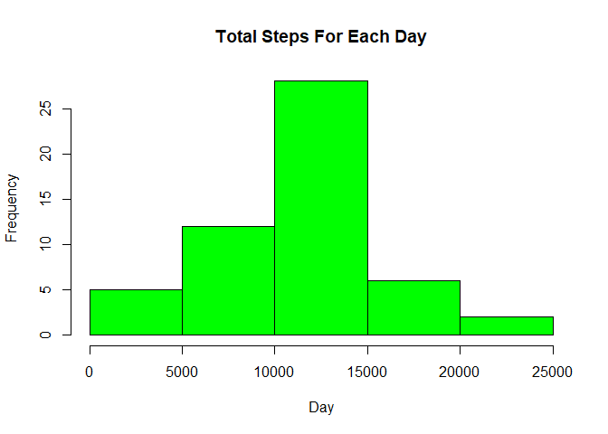

Reproducible Research: Peer Assessment 1
----------------------------------------

Loading and preprocessing the data
----------------------------------

First step is to load the data file and take a look at it’s structure

``` r
activity <- read.csv("activity.csv", colClasses = c("numeric", "character", "numeric"))
str(activity)
```

    ## 'data.frame':    17568 obs. of  3 variables:
    ##  $ steps   : num  NA NA NA NA NA NA NA NA NA NA ...
    ##  $ date    : chr  "2012-10-01" "2012-10-01" "2012-10-01" "2012-10-01" ...
    ##  $ interval: num  0 5 10 15 20 25 30 35 40 45 ...

We see that it is a dataframe with 17K oberservations with 3 variables,
steps, date, and interval. Formatting…

``` r
library(lattice)
activity$date <- as.Date(activity$date, "%Y-%m-%d")
```

What is mean total number of steps taken per day?
-------------------------------------------------

We ignore the missing values as per the assignment directions. First we
find the total steps taken. We first create an object called
TotalStepsTaken which sums the steps on each date. Then we simply apply
the mean function.

``` r
TotalStepsTaken <- aggregate(steps ~ date, data = activity, sum, na.rm=TRUE)
mean(TotalStepsTaken$steps)
```

    ## [1] 10766.19

The histogram is calculated as such:

``` r
hist(TotalStepsTaken$steps, main = "Total Steps For Each Day", col = "green", xlab = "Day")
```



What is the average daily activity pattern?
-------------------------------------------

we can use the tapply function which takes a variable, an index, and a
function, to create an object that stores the average steps taken
indexed across the 5-minute intervals. We then can create a plot and
calculate the maximum interval. Lastly, we can find the maximum
interval.

``` r
TS <- tapply(activity$steps, activity$interval, mean, na.rm=TRUE)
TSplot <- plot(row.names(TS), TS, type = "l", xlab = "5 Minute Interval", ylab = "Average Across Days", main = "Average Steps Taken", col = "green")
```


``` r
names(which.max(TS))
```

    ## [1] "835"

Imputing missing values
-----------------------

First we calculate the number of missing values.The is.na function will
return a string of TRUE/FALSE for every element in the table, and this
can be read as 1/0, so we can apply a sum function to that.

``` r
Missingvalues <- sum(is.na(activity))
Missingvalues
```

    ## [1] 2304

Now we fill in the missing values of the dataset. We will use the mean
for that interval.We need to create a for loop, and for every
observation, we examine that observation and determine if it has NA in
the steps. If it does, we find the corresponding mean interval in the
AvgSteps table and write it in. Otherwise we leave it alone. We put this
new completed list of steps into a new object, ReplacedNA.

``` r
AvgSteps <- aggregate(steps ~ interval, activity, mean)
ReplacedNA <- numeric()

for (i in 1:nrow(activity)) {
  observation <- activity[i,]
  
  if (is.na(observation$steps)) {
    steps <- subset(AvgSteps, interval == observation$interval)$steps
    } else {
    steps <- observation$steps
    }
  ReplacedNA <- c(ReplacedNA, steps)
  }
```

Creating a new dataset, filling in the missing NAs…

``` r
Complete_Activity <- activity
Complete_Activity$steps <- ReplacedNA
```

Making the required histogram and summarizing the steps…

``` r
TotalStepsTaken_2 <- aggregate(steps ~ date, Complete_Activity, sum, na.rm=TRUE)

hist(TotalStepsTaken_2$steps, main = "Total Steps Taken By Day", xlab = "Day", col = "green")
```


``` r
summary(TotalStepsTaken_2$steps)
```

    ##    Min. 1st Qu.  Median    Mean 3rd Qu.    Max. 
    ##      41    9819   10766   10766   12811   21194

We see that the replacement had no effect on the mean, but the median
has shifted slightly

Are there differences in activity patterns between weekdays and weekends?
-------------------------------------------------------------------------

We will create a new factor variable in the completed dataset with two
levels - “weekday” or “weekend”. This can be done with another for loop.
We create a vector object and for every row (day) in the completed
dataset, we check it’s day using the weekdays function. If it’s a
Saturday or Sunday, we assign a value of “Weekend” to our new vector
object, otherwise we assign a “Weekday” value.

``` r
day = weekdays(Complete_Activity$date)
dayvector <- vector()

for (i in 1:nrow(Complete_Activity)){
  if (day[i] == "Saturday") {
    dayvector[i] <- "Weekend"
  } else if (day[i] == "Sunday") {
    dayvector[i] <- "Weekend"
  } else {dayvector[i] <- "Weekday"}
}

Complete_Activity$dayvector <- dayvector
Complete_Activity$dayvector <- factor(Complete_Activity$dayvector)

StepsByDay <- aggregate(steps ~ interval + dayvector, Complete_Activity, mean)
names(StepsByDay) <- c("Interval", "DayVector", "Steps")
```

Last thing we will do is make a planel plot containing a time series
plot of the 5-minute interval on the x-axis and the average number of
steps taken averaged across all weekdays or weekend days on the y axis.

``` r
xyplot(Steps ~ Interval | DayVector, StepsByDay, type = "l", layout = c(1,2), xlab = "Interval", ylab = "Number of Steps")
```


